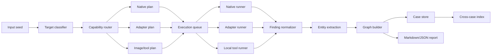

# План глубокой интеграции OSINT-сервисов

## Цель

Сделать из текущего набора native-модулей, adapters и toolbox не набор отдельных команд, а единый OSINT-агрегатор:

`один ввод -> все подходящие native checks и upstream tools -> единые findings -> entities -> graph -> case report`

Пример целевого поведения:

```powershell
python -m osint_toolkit search phone +380441234567 --profile phone-full --plan-only
python -m osint_toolkit search email person@example.com --profile email-full --plan-only
python -m osint_toolkit search username example_user --profile username-full --plan-only
python -m osint_toolkit search domain example.com --profile passive-recon --plan-only
```

Здесь оператор вводит один seed, а система сама:

- определяет тип цели;
- выбирает все совместимые native-модули и adapters;
- проверяет readiness внешних tools;
- запускает доступные tools в согласованном режиме;
- нормализует stdout/JSON/CSV/report files;
- объединяет дубли;
- строит entity graph;
- сохраняет кейс и отчёт.

## Что значит “снять ограничения”

Нужно снять операционное ограничение текущей архитектуры: оператор не должен вручную запускать каждый upstream-tool отдельно.

Не нужно снимать контроль законного scope, redaction, rate limits, audit trail и явное включение рискованных режимов. Эти вещи должны остаться частью системы, иначе aggregator станет плохо проверяемым и опасным для самого оператора.

Практическая модель:

- `plan` — показать, какие tools будут использованы и почему.
- `execute-safe` — запускать public/passive/low-risk tools, которые уже настроены.
- `execute-scoped` — запускать более широкие tools только после явного выбора профиля и записи scope в case metadata.
- `restricted` — password-recovery/account-enumeration/private-data flows не входят в default/full profiles; если они когда-либо добавляются, только отдельным режимом, отдельной маркировкой и отдельными тестами redaction.

## Текущая база

Уже есть:

- native engine: `scan person|username|email|phone|domain|url|telegram|instagram|social|ru-ua`;
- `investigate` для multi-target cases;
- adapter manifest `AdapterSpec`;
- adapter profiles: `username-full`, `username-ru-ua`, `email-safe`, `phone-safe`, `url-archive`, `domain-recon`, `broad-recon`;
- adapter runner с dry-run/execute;
- parsers для многих upstream outputs;
- generated report ingestion;
- SQLite case store;
- graph edges and cross-case entity index;
- static `toolbox` window.

Главный оставшийся gap: `search --plan-only` уже строит единый high-level fan-out plan, но execution queue, которая автоматически запускает все ready tools и ведёт весь запуск до отчёта, ещё не реализована.

## Целевая архитектура



Ключевые компоненты:

- `SearchRequest` — один или несколько seed values, profile, region, execution mode, scope metadata, limits.
- `Capability` — машинно-читаемое описание того, что tool умеет: target kinds, risk level, install/readiness, parser, output type, rate-limit hints.
- `SearchPlan` — конкретный список native/adapters/local tools для запуска.
- `ExecutionQueue` — запуск tools с timeout, retries, concurrency limits и per-tool logs.
- `ResultNormalizer` — приведение всего к `Finding`, `Entity`, `GraphEdge`.
- `ResultMerger` — дедупликация URL/email/phone/domain/profile hits, объединение confidence и source provenance.
- `CaseReport` — Markdown/JSON report + SQLite case store.

## Команды, которые нужно добавить

### `search`

Основная команда “один seed -> все сервисы”.

```powershell
python -m osint_toolkit search phone +380441234567 --profile phone-full --plan-only
python -m osint_toolkit search email person@example.com --profile email-full --region ua --plan-only
python -m osint_toolkit search username example_user --profile username-full --execute-adapters
python -m osint_toolkit search domain example.com --profile passive-recon --case-db cases.sqlite
```

Параметры:

- `target_kind` и `target_value`, либо `--auto` для определения типа.
- `--profile safe|full|ru-ua-full|passive-recon|broad-recon|custom`.
- `--plan-only` — только показать план.
- `--execute-adapters` — запускать внешние CLI.
- `--install-missing` — позже, после installer layer.
- `--case-db`, `--case-id`, `--out`, `--format markdown|json`.
- `--max-tools`, `--timeout`, `--concurrency`, `--request-delay`.
- `--scope-note` — текстовое основание/контекст проверки, сохраняется в case metadata.

### `tools install`

Единая установка внешних tools из manifest.

```powershell
python -m osint_toolkit tools install phone-safe
python -m osint_toolkit tools install username-full
python -m osint_toolkit tools install domain-recon
python -m osint_toolkit tools doctor --profile all-safe
```

Первый вариант должен быть осторожным:

- показывать команды установки;
- проверять PATH/env;
- не скачивать непроверенный код без явного подтверждения;
- поддерживать Windows notes.

### `profiles`

Пользовательские profiles поверх manifest.

```powershell
python -m osint_toolkit profiles list
python -m osint_toolkit profiles show phone-full
python -m osint_toolkit profiles export phone-full --out profiles/phone-full.json
```

Формат profile:

```json
{
  "name": "phone-full",
  "target_kinds": ["phone"],
  "native": ["phone"],
  "adapters": [
    "sundowndev/phoneinfoga",
    "smicallef/spiderfoot",
    "jasonxtn/argus",
    "Yvesssn/DetectDee"
  ],
  "excluded_by_default": [
    "megadose/ignorant"
  ]
}
```

## Направления интеграции

### Phone

Цель: пользователь вводит телефон, система запускает всё применимое.

Target:

```powershell
python -m osint_toolkit search phone +380441234567 --profile phone-full --execute-adapters
```

Состав:

- native `scan phone`: нормализация, E.164-like validation, country prefix.
- `sundowndev/phoneinfoga`: phone intelligence.
- `smicallef/spiderfoot`: passive phone target mode, если `SPIDERFOOT_SF_PATH` настроен.
- `jasonxtn/argus`: broad infra/OSINT route, если установлен.
- `Yvesssn/DetectDee`: кандидат для phone/email/username checks после CLI mapping.
- `megadose/ignorant`: только restricted profile, не default/full.

Что нужно реализовать:

- profile `phone-full`;
- router: `phone -> native phone + phone-safe + broad-recon phone-compatible`;
- parser gap review для SpiderFoot/Argus phone-specific output;
- confidence model: normalized phone, country/carrier/location/search URLs, account-like hits отдельно;
- report section `Phone Sources`.

Acceptance:

- `search phone ... --plan-only` показывает все совместимые tools и почему missing tools пропущены.
- `search phone ... --execute-adapters` запускает все ready tools без ручного перечисления.
- отчёт показывает source-by-source results, dedupe и graph.

### Email

Target:

```powershell
python -m osint_toolkit search email person@example.com --profile email-full --execute-adapters
```

Состав:

- native email: syntax, domain, MX/NS/TXT, SPF, DMARC, MTA-STS, TLS-RPT, BIMI, service markers.
- `alpkeskin/mosint`: email reputation, breaches, related emails/domains, search URLs, DNS.
- `khast3x/h8mail`: breaches and related emails.
- `thewhiteh4t/pwnedOrNot`: compromised email lookup.
- `kaifcodec/user-scanner`: email account checks.
- `p1ngul1n0/blackbird`: email account discovery.
- `smicallef/spiderfoot`: email target.
- `jasonxtn/argus`: email target.
- `megadose/holehe`, `martinvigo/email2phonenumber`: restricted, separate profile only.

Что нужно реализовать:

- profile `email-full`;
- parser coverage for pwnedOrNot if not complete;
- API key readiness metadata grouped by provider;
- redaction tests for breach/password/hash/token-like values;
- output grouping: auth/security, breach/reputation, related identities, domains, URLs.

Acceptance:

- один email запускает all ready email-compatible adapters;
- secrets and credential-like values never appear in reports;
- related emails/domains enter graph with provenance.

### Username / Person / Social

Target:

```powershell
python -m osint_toolkit search username example_user --profile username-full --execute-adapters
python -m osint_toolkit search person "Ivan Petrenko" --profile person-full --region ua
```

Состав:

- native person expansion.
- native username checks with Sherlock/WhatsMyName/Maigret datasets.
- Sherlock external reports.
- Maigret external reports.
- Social Analyzer.
- Blackbird.
- Nexfil.
- Snoop RU/UA.
- user-scanner.
- Instaloader for Instagram.
- DetectDee / socialscan candidates after mapping.

Что нужно реализовать:

- `person-full` profile: person expansion -> derived username fan-out.
- profile-specific derived target limits.
- platform scoring and conflict handling.
- Snoop/Maigret/Social Analyzer RU/UA routing.
- optional screenshots/OCR remains separate because it changes data volume and dependencies.

Acceptance:

- `search person` creates derived usernames and runs compatible tools automatically.
- all profile URLs dedupe by normalized URL/platform/username.
- report separates `candidate`, `not_found`, `error`, `skipped`.

### Domain / URL / Web

Target:

```powershell
python -m osint_toolkit search domain example.com --profile passive-recon --execute-adapters
python -m osint_toolkit search url https://example.com --profile web-full --execute-adapters
```

Состав:

- native domain/url: DNS, HTTP, crawler, robots/sitemap, CT, RDAP, WHOIS.
- Subfinder.
- httpx.
- passive Amass.
- theHarvester.
- BBOT passive.
- SpiderFoot passive.
- Argus infra route.
- Yark for URL/media archive workflows.

Что нужно реализовать:

- profiles `passive-recon`, `web-full`;
- host normalization and root-domain extraction;
- duplicate entity merge across CT/Subfinder/Amass/BBOT/SpiderFoot;
- better parser for Yark outputs;
- result severity/risk tags for exposed tech, open ports and findings.

Acceptance:

- one domain produces combined subdomain, URL, email, phone, IP, port, tech graph.
- report shows per-tool coverage and missing config.
- active/bruteforce modules are not accidentally enabled in passive profile.

### Image / Photo

Target:

```powershell
python -m osint_toolkit search image C:\evidence\photo.jpg --profile image-full
```

Состав:

- local baseline/hash.
- ExifTool metadata.
- ImageMagick identify.
- Tesseract OCR.
- zbarimg QR/barcodes.
- reverse image portals in toolbox.
- extracted URL/email/phone/username/domain clues routed into `search` as derived targets.

Что нужно реализовать:

- `image` target kind.
- local tool runner for `exiftool`, `magick`, `tesseract`, `zbarimg`.
- parser for EXIF JSON output and OCR text extraction.
- derived target extraction from OCR/QR/metadata.
- no face recognition, no identity-by-face matching.

Acceptance:

- one image yields metadata findings, OCR findings, QR findings and derived OSINT seeds.
- derived seeds can run through normal `search` fan-out.
- report clearly marks local metadata vs external search routes.

### Telegram / Instagram / RU Social / RU-UA

Состав:

- native Telegram public metadata.
- native Instagram public metadata.
- native VK/OK/Yandex/Mail.ru public metadata.
- Snoop/Maigret/Social Analyzer RU/UA filters.
- RU/UA source pack.

Что нужно реализовать:

- `social-full` profile;
- platform-specific target classifiers: `@handle`, `t.me`, `instagram.com`, `vk.com`, `ok.ru`, Yandex/Mail.ru profile-like URLs;
- common output schema for display name, account id, public URLs, platform, domain, public counters;
- optional archive adapter routing where lawful and supported.

Acceptance:

- social URL/handle automatically routes to the right native module and compatible adapters.
- RU/UA region setting affects Snoop/Maigret/Social Analyzer.

## Installation and readiness layer

Проблема пользователя: “не хочу подключать каждый сервис отдельно”.

Решение:

1. `tools doctor --profile <profile>` показывает missing/ready/config-required.
2. `tools install-plan <profile>` генерирует команды установки под Windows.
3. `tools install <profile>` можно добавить позже как explicit mode with prompts.
4. `tools env` показывает только names of required variables, never values.

Минимальный install matrix:

- Python/pip/pipx: Sherlock, Maigret, h8mail, Nexfil, Instaloader, Yark, BBOT, Argus.
- Go: Mosint, Subfinder, httpx, Amass.
- Manual/binary: PhoneInfoga, Snoop, SpiderFoot, Blackbird, Social Analyzer, theHarvester.
- Local image tools: ExifTool, ImageMagick, Tesseract, zbarimg.

## Profiles to add

Первый набор:

- `phone-full`
- `email-full`
- `person-full`
- `social-full`
- `passive-recon`
- `web-full`
- `image-full`
- `ru-ua-full`
- `all-safe`

Profile fields:

- `name`
- `target_kinds`
- `native_modules`
- `adapter_profiles`
- `adapter_repositories`
- `local_tools`
- `default_execution_mode`
- `max_concurrency`
- `default_timeout`
- `excluded_repositories`
- `scope_requirements`

## Parser and normalization backlog

Приоритет 1:

- pwnedOrNot parser hardening.
- DetectDee CLI mapping and parser.
- SpiderFoot phone/email/username mode examples.
- Argus per-target parser fixtures.
- ExifTool JSON parser.
- Tesseract OCR text parser and seed extractor.
- zbarimg parser.

Приоритет 2:

- Socialscan integration review.
- Yark output parser.
- Maigret richer dossier fields.
- BBOT broader passive presets with explicit profile.
- theHarvester API-source attribution.

## Unified output model

Каждый result должен иметь:

- source tool;
- source command or native module name;
- target kind/value;
- status: `candidate`, `confirmed`, `not_found`, `skipped`, `error`, `metadata`;
- confidence;
- evidence summary;
- redacted raw excerpt if safe;
- entities;
- graph edges;
- execution metadata: start/end/duration, exit code, timeout, parser version.

## Safety and audit controls

Для security use-case важны не “запреты ради запретов”, а воспроизводимость и контролируемость:

- каждое внешнее выполнение записывает tool, version if available, command args without secrets, exit code and duration;
- secret/API key values never printed;
- password/hash/token-like values redacted;
- report distinguishes public metadata, inferred signals and account-like hits;
- restricted flows excluded from normal full profiles;
- per-tool timeout and rate limit;
- `--scope-note` saved into case metadata;
- all risky expansions must be visible in `--plan-only`.

## Этапы реализации

### Этап 1 — Unified Search Router

Deliverables:

- `osint_toolkit/search.py`;
- CLI `search`;
- `SearchProfile`, `LocalToolSpec`, `PlannedStep`, `SearchPlan`;
- auto target classifier;
- mapping target kind -> native modules + adapter profiles + local image tools;
- `--plan-only`.

Status: implemented in the current codebase.

Tests:

- plan for phone/email/username/domain/image includes expected tools;
- missing adapters appear as missing, not as failures;
- profile filtering works.

### Этап 2 — Fan-out Execution

Deliverables:

- execute ready adapters automatically from `SearchPlan`;
- per-tool timeout/concurrency;
- combined markdown/json report;
- case-store save.

Tests:

- mocked external adapters run in order/queue;
- failed adapter does not fail the whole search;
- duplicate entities merge.

### Этап 3 — Install/Readiness UX

Deliverables:

- `tools doctor --profile`;
- `tools install-plan --profile`;
- Windows-specific install notes;
- local image tool readiness checks.

Tests:

- PATH/env detection;
- missing required env shown without values;
- install plan stable.

### Этап 4 — Profiles and Custom Profiles

Deliverables:

- built-in profiles listed above;
- JSON import/export for custom profiles;
- profile validation.

Tests:

- invalid repo/profile rejected;
- target kind compatibility checked.

### Этап 5 — Image Pipeline

Deliverables:

- `search image <path>`;
- ExifTool/ImageMagick/Tesseract/zbarimg local tool adapters;
- OCR/QR/metadata seed extraction;
- derived targets fan-out into normal search.

Tests:

- sample image fixtures;
- OCR text -> URL/email/phone extraction;
- EXIF GPS redaction/flagging rules.

### Этап 6 — UI Execution Window

Deliverables:

- local backend server or controlled desktop runner;
- toolbox can execute queued commands through backend;
- visible queue, logs, status and report links.

Notes:

- current static HTML is safe for command generation;
- execution UI needs a local backend because browsers cannot safely run shell commands directly.

## First implementation order

1. Done: add `search --plan-only` for phone/email/username/person/domain/url/image/social/ru-ua.
2. Done: add built-in `phone-full`, `email-full`, `image-full`, `all-safe` and related profiles.
3. Next: add `tools doctor --profile`.
4. Next: add fan-out execution for ready adapters.
5. Next: add image local tool execution and derived seed extraction.
6. In progress: replace toolbox command cards with `search` commands where high-level routing is stable.

## Definition of done

Goal is complete only when:

- one CLI command can accept phone/email/username/person/domain/url/image/social seeds;
- for each seed type, the system automatically selects all compatible native modules and adapters;
- the operator does not need to manually call each upstream tool;
- missing tools/config are reported clearly;
- ready tools can execute and parse into unified findings;
- reports include per-tool provenance, entities, graph and case storage;
- tests cover planning, execution, parser normalization, redaction and docs;
- toolbox exposes the unified `search` flows instead of separate low-level commands.
